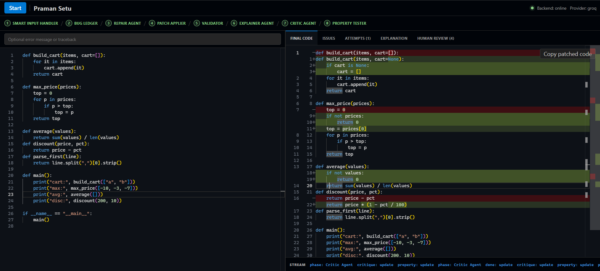
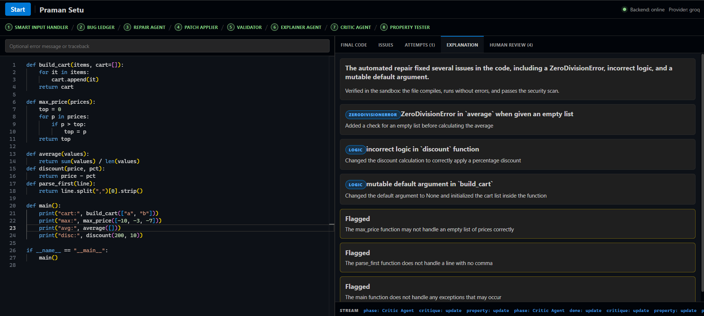
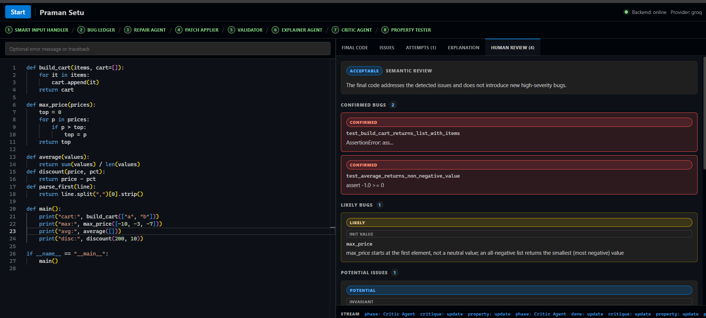
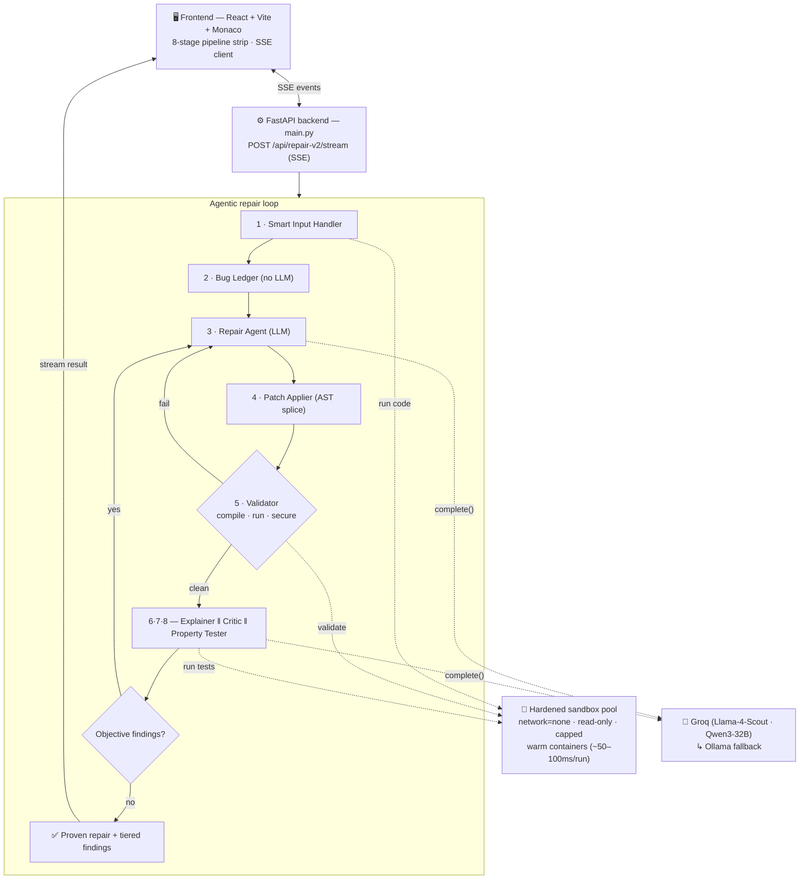

# 🛡️ Praman Setu

> **"Praman Setu" — the bridge of proof.** An autonomous Python debugging-and-repair
> assistant that returns **fixed code whose correctness is mechanically proven** —
> not suggested. Every accepted change has passed an execution-backed validator, and
> suspected logic bugs are escalated from *"the model thinks so"* to *"a failing test proves so."*

**Code generation + debug assistant — multi-agent · deterministic tools · 1 hardened sandbox.**
For the deep design, see [ARCHITECTURE_OVERVIEW.md](ARCHITECTURE_OVERVIEW.md) and [FINAL_ARCHITECTURE.md](FINAL_ARCHITECTURE.md).


---

## 📑 Contents

- [The thesis](#-the-thesis)
- [See it in action](#-see-it-in-action)
- [Example — before & after](#-example--before--after)
- [Quick start](#-quick-start)
- [How it works — the repair pipeline](#-how-it-works--the-repair-pipeline)
- [Architecture](#-architecture)
- [Key innovations](#-key-innovations)
- [Tech stack](#-tech-stack)
- [API reference](#-api-reference)
- [Project structure](#-project-structure)
- [Testing](#-testing)
- [Roadmap](#-roadmap)
- [Team](#-team)
- [License](#-license)

---

## ✨ The thesis

Ordinary "ask an LLM to fix my code" has three failure modes Praman Setu is built to defeat:

| Failure mode | How Praman Setu defeats it |
|---|---|
| **The model says it fixed it, but it didn't** | A deterministic **Validator** runs the patched file in a sandbox. No green gates → the patch is rejected, never returned. |
| **It fixes the first crash and stops** | A whole-file **Bug Ledger** maps *all* defects up front (syntax, runtime, anti-patterns), so one pass addresses the whole file, not just line 1. |
| **It silently changes behavior / guesses business rules** | A **Critic** + **Property Tester** audit the *working* code; objective bugs are auto-fixed and re-validated, while intent-dependent choices are flagged, not guessed. |

---

## 📸 See it in action

Paste a buggy Python file, hit **Repair**, and watch the 8-stage pipeline run live.

### Proven fix — side-by-side diff
Every bug is repaired and validated in the sandbox; the patch is copy-ready.



### Plain-language explanation
The Explainer narrates what was broken and what changed — and is honest about anything it had to flag.



### Tiered, de-duplicated Human Review
Findings are ranked by **confidence** — *Confirmed* (proven by a failing test), *Likely* (deterministic pattern), *Potential* (intent-dependent) — not dumped as a pile.



---

## 🎯 Example — before & after

A single file with **four different bug classes** — a crash, a mutable default, a wrong
initial value, and an intent-ambiguous formula — repaired in **one pass**:

```python
# ── BEFORE (pasted by the user) ──────────────────────────
def build_cart(items, cart=[]):          # mutable default — leaks between calls
    for it in items: cart.append(it)
    return cart

def max_price(prices):
    top = 0                              # returns 0 for an all-negative list
    for p in prices:
        if p > top: top = p
    return top

def average(values):
    return sum(values) / len(values)     # ZeroDivisionError on []

def discount(price, pct):
    return price - pct                   # treats a percent as a flat amount
```

```python
# ── AFTER (proven in the sandbox) ────────────────────────
def build_cart(items, cart=None):
    if cart is None: cart = []           # ✅ no shared state
    for it in items: cart.append(it)
    return cart

def max_price(prices):
    if not prices: return None
    top = prices[0]                      # ✅ seeded from a real element
    for p in prices:
        if p > top: top = p
    return top

def average(values):
    if not values: return 0              # ✅ empty-input guard
    return sum(values) / len(values)

def discount(price, pct):
    return price * (1 - pct / 100)       # ✅ best-guess fix, flagged for review
```

| What caught it | Bug |
|---|---|
| **Bug Ledger** (static linter) | `build_cart` mutable default |
| **Validator** (sandbox run) | `average([])` ZeroDivisionError |
| **Property Tester** (Hypothesis counterexample) | `max_price` returns 0 for negatives |
| **Critic** (intent question) | `discount` — percent vs. flat amount (best-guessed + flagged) |

---

## 🚀 Quick start

### Prerequisites
- **Docker Desktop** (WSL2 backend on Windows) — runs the hardened execution sandbox.
- A **[Groq](https://console.groq.com) API key** (free tier works).
- For local dev: **Python ≥ 3.11** + **Node ≥ 18** (or just use Docker Compose).

### Option A — Docker Compose (everything, hot-reload)

```bash
# 1. Configure secrets
cp .env.example .env          # then edit .env and set GROQ_API_KEY

# 2. Build the sandbox image (spawned per-execution by the backend pool)
docker compose build sandbox

# 3. Bring up backend + frontend
docker compose up --build
```

- Frontend → **http://localhost:5173**
- Backend  → **http://localhost:8000/health**

### Option B — Local dev (host processes)

```bash
# Backend (FastAPI + uvicorn) — uv-managed deps
uv sync
uv run uvicorn backend.main:app --host 127.0.0.1 --port 8000 --reload

# Build the sandbox image once (needs Docker running)
docker compose build sandbox

# Frontend (Vite dev server)
cd frontend && npm install && npm run dev
```

> **Windows hot-reload:** set `WATCHFILES_FORCE_POLLING=true` before `uvicorn` so file
> changes are detected. The frontend talks to the backend at `http://localhost:8000`
> (see `API` in [frontend/src/App.tsx](frontend/src/App.tsx)).

---

## 🧩 How it works — the repair pipeline

The 8 UI stages map directly to backend events streamed over **Server-Sent Events (SSE)**:

```
1 Smart Input  ─► 2 Bug Ledger ─► 3 Repair Agent ─► 4 Patch Applier ─► 5 Validator
                                                                            │ (clean)
                                                                            ▼
                          6 Explainer  ‖  7 Critic  ‖  8 Property Tester
                                       └──► Review-driven re-repair (validator-gated)
```

| # | Stage | What happens | File |
|---|-------|--------------|------|
| 1 | **Smart Input Handler** | Detect language; run the file once under a `sys.settrace` harness to capture the real crash + variable snapshots. | [input_handler/service.py](backend/input_handler/service.py), [tools/tracer.py](backend/tools/tracer.py) |
| 2 | **Bug Ledger** | Whole-file defect map (no LLM): syntax/runtime errors + an AST semantic linter (mutable defaults, swallowed exceptions, infinite loops, background threads). | [tools/bug_ledger.py](backend/tools/bug_ledger.py), [tools/semantic_lint.py](backend/tools/semantic_lint.py) |
| 3 | **Repair Agent** | One LLM call returns whole corrected code **units** (function/class/`<module>`/`<file>`), not text fragments. | [agents/multi_issue_fixer.py](backend/agents/multi_issue_fixer.py) |
| 4 | **Patch Applier** | Deterministically splice each unit via the **AST**, compile-checking after every edit. | [tools/patch_applier.py](backend/tools/patch_applier.py) |
| 5 | **Validator** | Re-run the candidate in the sandbox: must compile, run clean, and pass the security scan — or the errors become feedback for another pass. | [orchestrator/repair_v2.py](backend/orchestrator/repair_v2.py) |
| 6 | **Explainer** | Plain-language narrative; the verification claim is derived from the proven status (never hallucinated). | [agents/explainer.py](backend/agents/explainer.py) |
| 7 | **Critic** | Semantic audit of the working code (init value, boundary, return contract, edge case, shared state, invariant). | [agents/critic.py](backend/agents/critic.py) |
| 8 | **Property Tester** | Generates **Hypothesis** property tests for *intent-independent* invariants, runs them, and turns suspected bugs into **proven** ones with a counterexample. | [agents/property_tester.py](backend/agents/property_tester.py) |

**Review-driven re-repair:** objective findings from stages 6–8 are fed back to the Repair
Agent to *fix* (not just flag), and each candidate must re-compile, re-run clean, and stay
secure — so review never makes the code worse. → [orchestrator/proof_repair.py](backend/orchestrator/proof_repair.py)

---

## 🏗️ Architecture



---

## 💡 Key innovations

1. **Proof over assertion** — a 5-gate Validator (syntax · type · security · test · diff-regression) plus anti-cheat guards that reject stubs, bare `except: pass`, and re-raises. → [tools/validator.py](backend/tools/validator.py)
2. **Whole-file Bug Ledger** — no "first-crash tunnel vision"; every defect is mapped before the first LLM call.
3. **AST unit-splicing** — eliminates brittle string-match and indentation-corruption failure modes of LLM patches.
4. **Prove the logic bug** — Critic *reasons*, Property Tester *proves* via Hypothesis counterexamples, on intent-independent invariants only.
5. **Review that repairs, validator-gated** — most tools flag and stop; this one fixes and re-proves.
6. **Execution tracer** — observed variable values, not speculation. → [tools/tracer.py](backend/tools/tracer.py)
7. **Warm hardened sandbox pool** — `network=none`, read-only rootfs, all caps dropped, non-root, mem/PID/CPU capped, tmpfs-only; pre-warmed containers reused via `docker exec` (~50–100 ms/run). → [tools/sandbox/pool.py](backend/tools/sandbox/pool.py)
8. **Deterministic non-termination neutralization** — rewrites import-time background threads to `daemon=True` so they can be validated. → [tools/neutralize.py](backend/tools/neutralize.py)
9. **Tiered, de-duplicated findings** — confidence, not a pile. → [agents/findings.py](backend/agents/findings.py)
10. **Per-role model routing + provider fallback** — right-sized models with transparent Groq→Ollama failover. → [llm/models.py](backend/llm/models.py)

---

## 🛠️ Tech stack

| Layer | What |
|---|---|
| **Frontend** | React 18 + Vite + **Monaco editor** (inline diff), TypeScript, Server-Sent Events |
| **Backend** | FastAPI + uvicorn, Pydantic, **SSE streaming** |
| **Orchestration** | `repair_v2` loop + `proof_repair`; **LangGraph** state machine (resumable, SQLite-checkpointed) for the legacy single-bug path |
| **LLMs** | **Groq** — Llama‑4‑Scout‑17B (reasoning) · Qwen3‑32B (code) · **Ollama** local fallback (Llama‑3.1‑8B / Qwen2.5‑Coder) |
| **Property testing** | Hypothesis + pytest, run in-sandbox |
| **Sandbox** | Docker (`network=none`, read-only, capped), tree-sitter AST parsing, Bandit security scan |
| **Deps** | Python managed by **uv**; frontend by **npm** |

---

## 🔌 API reference

All endpoints are served by [backend/main.py](backend/main.py).

| Endpoint | Purpose |
|---|---|
| `GET /health` | Provider, sandbox-pool, and checkpointing status |
| `POST /api/input/handle` | Run the Smart Input Handler only |
| `POST /api/analyze` | Full single-bug LangGraph pipeline (`?debug=true` adds a perf trace) |
| `POST /api/repair-v2` | **Primary** whole-file repair (JSON result) |
| `POST /api/repair-v2/stream` | **Primary** repair as SSE — what the UI uses |
| `POST /api/fix` | Repair entry with `strategy=repair_v2 \| iterative`, `stream=true` |

**Example:**
```bash
curl -X POST http://localhost:8000/api/repair-v2 \
  -H "Content-Type: application/json" \
  -d '{"code": "def avg(xs):\n    return sum(xs)/len(xs)", "filename": "app.py"}'
```

---

## 📂 Project structure

```
backend/
├── main.py                  FastAPI app + SSE endpoints
├── agents/                  multi_issue_fixer · critic · explainer · property_tester · findings
│                            (legacy graph: diagnoser · patcher · reflector)
├── orchestrator/            repair_v2 · proof_repair · graph · iterative · state
├── tools/                   bug_ledger · semantic_lint · neutralize · patch_applier
│   ├── validator.py         5-gate validator + anti-cheat guards
│   ├── tracer.py            settrace execution evidence
│   └── sandbox/             pool.py (warm pool) · executor.py (hardened exec)
├── llm/                     client.py (Groq + Ollama) · models.py (per-role registry)
└── observability/           metrics.py (LLM-call + run-trace metrics)

frontend/
└── src/App.tsx              single-page UI (editor, pipeline strip, SSE, tabs)

screenshots/                 UI captures used in this README
docker-compose.yml           backend (8000) + frontend (5173) + sandbox image
pyproject.toml               uv-managed Python deps
```

---

## 🧪 Testing

```bash
uv run pytest                # unit tests (integration tests are opt-in)
uv run pytest -m integration # exercises the real Docker sandbox / live LLM
```

---

## 📝 Notes

- **Dependencies use `uv`**, not pip/venv. Edit [pyproject.toml](pyproject.toml), then `uv lock` to refresh `uv.lock`.
- **Docker socket**: the backend mounts `/var/run/docker.sock` so the pool can spawn sandbox containers — a dev convenience with real privilege; harden for production (rootless/remote daemon or gVisor, see FINAL_ARCHITECTURE.md §4.3).
- **Ollama from a container** is reachable at `http://host.docker.internal:11434/v1`, not `localhost`.
- Only **Python** is supported today; additional language adapters are on the roadmap.

---

## 🗺️ Roadmap

- [x] **Phase 1 — Foundation:** FastAPI + LangGraph, Groq client with Ollama fallback, end-to-end Python repair, basic UI.
- [x] **Phase 2 — Proof & quality:** 5-gate Validator, warm sandbox pool, Critic + Property Tester, review-driven re-repair, SSE streaming.
- [ ] **Phase 3 — Intelligence & reach:** persistent bug memory (vector store), multi-language adapters (JS / Java / Go / Rust), GitHub PR creation, evaluation CI.

---

## 👥 Team

**Team Pandavas** — *Exceller AgentifAI Buildathon 2026* · Challenge #04: Code Generation + Debug Assistant.

Atharva Raje · Dhruvansh Mishra · Sahil Arora · Atharva Mali · Ishan Desale —
spanning business analysis, AI engineering, product strategy, AI-systems architecture, and full-stack development.

---

## 📄 License

Hackathon prototype — no license file is included yet. Add a `LICENSE` (e.g. MIT) before
any public release or redistribution.
